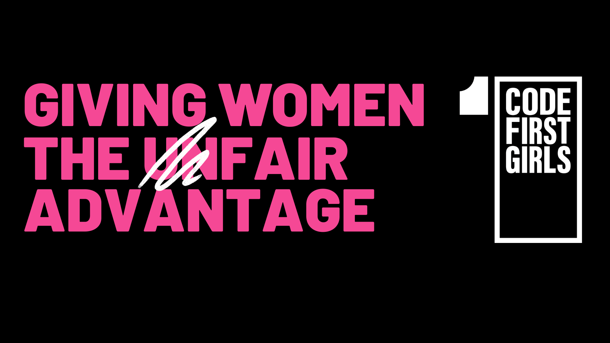
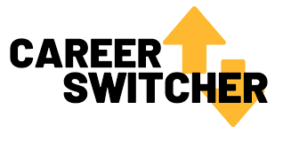
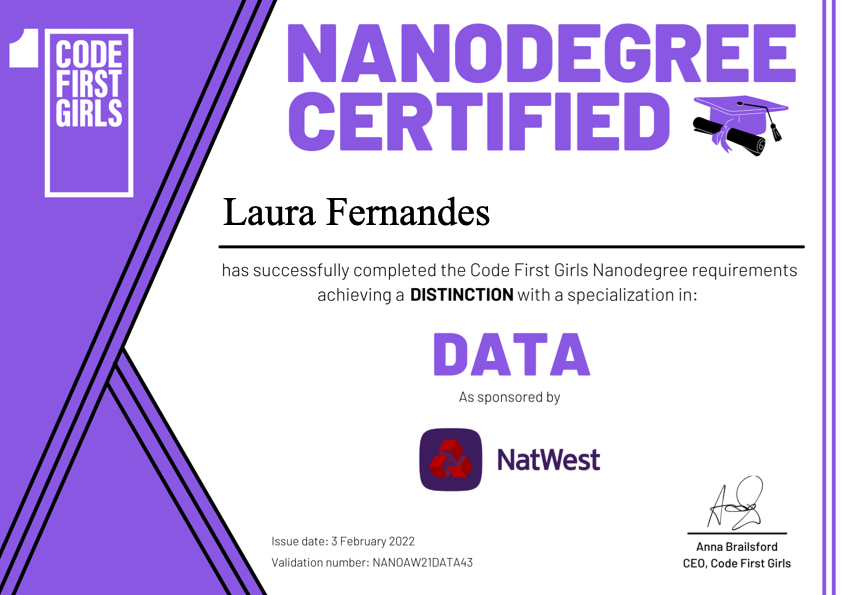

# CodeFirstGirls-Nanodegree_Notebooks
<table><tr>

 <td>   </td>
 <td>  </td>

</tr></table>

 
 
 

## Topics Covered in Data Path:

* Pandas library and Data Frame
* Statistical concepts in Data Analysis
* Data processing in Data Analysis: data modelling, data cleaning with Pandas
* Numpy
* Matplotlib & Seaborn (visualisation libraries)
* Decision trees and predictive analysis techniques 
* Introduction to Machine Learning & Regression analysis (Scikit-learn)
* Introduction to Predictive Modelling

 
 
 

 
 

